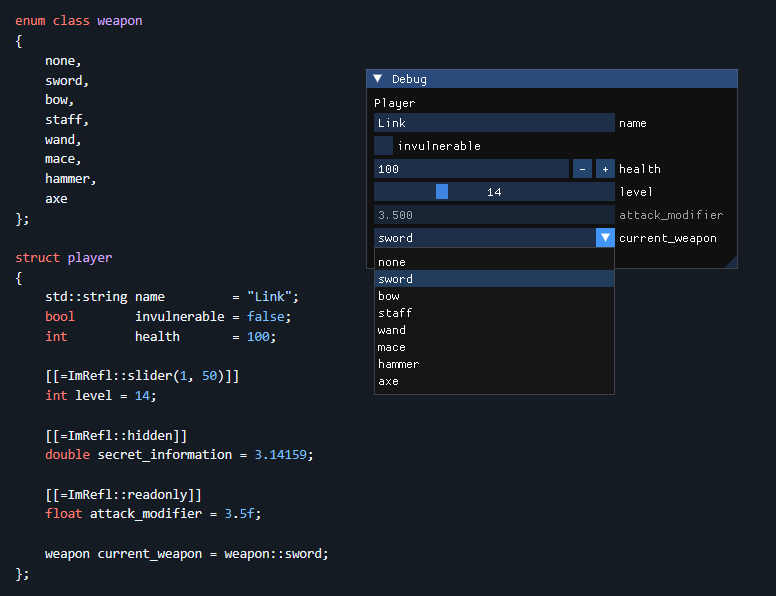

# ImRefl - A C++26 reflection library for ImGui

A library utilising C++26 reflection features to generate ImGui rendering code at compile time for structs without the need for macro magic or addional boilerplate.



Simply include the header, declare your types and call `ImRefl::Input`:

```cpp
player main_player = {};
ImGui::Begin("Debug");
ImRefl::Input("Player", main_player);
ImGui::End();
```

That's it! No macros or other setup needed!

## Features
### Supported types
* Aggregate structs.
* Enum classes.
* All arithmetic types including `long double`.
* `bool` is rendered as a checkbox.
* `char` is treated as a character rather than an 8 bit integer. 
* `std::string`.
* `std::pair<L, R>`.
* `std::optional<T>`.
* `std::array<T, N>`, `std::span<T>` and C-style arrays `T[N]`.
* All vector types from the GLM graphics library, e.g. `glm::vec2` and `glm::ivec3`.
    * These are not enabled by default. To enable, add the line `#define INREFL_GLM` above the include.

### Annotations

| Annotation                 | Description                         |
|----------------------------|-------------------------------------|
| `ImRefl::ignore`           | Skips the data member when rendering the widget. |
| `ImRefl::readonly`         | Shows the field on the widget but makes it non-interactable. |
| `ImRefl::normal`           | Sets the visual style of arithmetic types (and arrays of) to a standard input box. This is the default option, but this is provided for consistency. |
| `ImRefl::slider(min, max)` | Changes the visual style of arithmetic types (and arrays of) to a slider with the given limits. |
| `ImRefl::drag(min, max, speed=1.0f)` | Changes the visual style of arithmetic types (and arrays of) to a dragger with the given limits and speed. |
| `ImRefl::color`            | Renders the annotated field as a color picker. Works for 3 and 4 dimensional arrays and spans as well as `glm::vec3` and `glm::vec4`. |
| `ImRefl::color_wheel`      | Similar to the above but a full color wheel. |
| `ImRefl::string` | For C-style char arrays, formats them as a fixed size string rather than a set of values. |
| `ImRefl::radio` | For enum classes. Displays the enum as a series of radio buttons rather than a dropdown. |

## Future work
* All reasonable standard library types (for some definition of reasonable).
* Support for third party types such as the GLM library.
* More annotations for other ImGui visual styles and customisation points.
